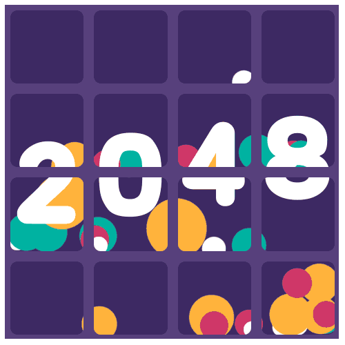

<div align="center">
  
  <h1>2048 Animated</h1>
  <p>An animated, modern React implementation of the classic 2048 puzzle game featuring dynamic tile animations, custom pixel GIFs, and fluid transition effects.</p>

  <p>
    <a href="https://reactjs.org/"></a>
    <a href="https://developer.mozilla.org/en-US/docs/Web/JavaScript"></a>
    <a href="https://sass-lang.com/"></a>
    <a href="https://github.com/features/actions"></a>
    <a href="https://pages.github.com/"></a>
  </p>

  <p>
    <a href="#features">Features</a> •
    <a href="#how-to-play">How to Play</a> •
    <a href="#tech-stack">Tech Stack</a> •
    <a href="#getting-started">Getting Started</a> •
    <a href="#deployment">Deployment</a>
  </p>
</div>

---

## Overview

**2048 Animated** is a responsive web-based puzzle game built with React and SCSS. In addition to the classic slide-and-merge gameplay mechanics, this version brings the board to life with custom animated GIF states for every number tile from 2 up to 2048, smooth CSS grid animations, real-time score tracking, and victory/game-over overlays.

## Features

- **Animated Tile Graphics**: Unique animated pixel GIFs for each tile value (`2`, `4`, `8`, `16`, `32`, `64`, `128`, `256`, `512`, `1024`, and `2048`).
- **Smooth Movement & Merge Animations**: SCSS keyframe transitions for sliding rows and columns, pop-in effects for new tiles, and merge animations.
- **Score Tracking & Reset**: Real-time score counter and one-click **New Game** reset.
- **Game State Detection**: Built-in win detection upon reaching tile 2048 and game-over detection when no valid moves remain.
- **Automated CI/CD**: Pre-configured GitHub Actions workflow for zero-config deployment to GitHub Pages.

## How to Play

Use your keyboard arrow keys to slide tiles across the board:

| Key | Action |
| --- | --- |
| <kbd>&uarr;</kbd> Up Arrow | Slide tiles upward |
| <kbd>&darr;</kbd> Down Arrow | Slide tiles downward |
| <kbd>&larr;</kbd> Left Arrow | Slide tiles to the left |
| <kbd>&rarr;</kbd> Right Arrow | Slide tiles to the right |

When two tiles with the same number collide during a move, they merge into one tile with double the value. Reach the **2048** tile to win!

## Tech Stack

- **Framework**: [React 17](https://reactjs.org/)
- **Styling**: [SCSS / Sass](https://sass-lang.com/) with custom animations and keyframes
- **Font**: Custom Clear Sans typography
- **CI/CD**: GitHub Actions & GitHub Pages

## Project Structure

```text
2048-animated/
├── .github/
│   └── workflows/
│       └── deploy.yml          # GitHub Pages CI/CD workflow
├── public/                     # Static HTML template and icons
├── src/
│   ├── assets/
│   │   └── img/                # Animated tile GIFs and game overlays
│   ├── components/
│   │   ├── Cell.js             # Background grid cell component
│   │   ├── GameOverlay.js      # Game over / Victory overlay
│   │   └── Tile.js             # Dynamic animated tile component
│   ├── helper/                 # Board logic, tile math, and movement matrices
│   ├── hooks/                  # Custom React hooks (e.g., keyboard listeners)
│   ├── App.js                  # Main application component
│   ├── main.scss               # Primary styles, palette, and layout
│   └── styles.scss             # Dynamic grid and slide animation keyframes
└── package.json
```

## Getting Started

### Prerequisites

- [Node.js](https://nodejs.org/) (version 18 or higher recommended)
- [npm](https://www.npmjs.com/)

### Installation

1. Clone the repository:
   ```bash
   git clone https://github.com/<your-username>/2048-animated.git
   cd 2048-animated
   ```

2. Install dependencies:
   ```bash
   npm install
   ```

### Running Locally

Start the local development server:

```bash
npm start
```

Open [http://localhost:3000](http://localhost:3000) in your browser to play the game.

### Production Build

Create an optimized production build:

```bash
npm run build
```

The output files will be generated in the `build/` directory.

## Deployment

This repository includes a ready-to-use GitHub Actions workflow in [`.github/workflows/deploy.yml`](.github/workflows/deploy.yml) that automatically builds and publishes the game to GitHub Pages on every push to `master` or `main`.

### Enabling GitHub Pages

1. Navigate to your repository on GitHub.
2. Go to **Settings** > **Pages**.
3. Under **Build and deployment** > **Source**, select **GitHub Actions**.
4. Push your changes or trigger the workflow manually from the **Actions** tab.

> [!TIP]
> The `package.json` file is configured with `"homepage": "./"`, allowing relative asset paths so your deployment works across custom domains or standard `<username>.github.io/<repository>` subpaths without additional configuration.
